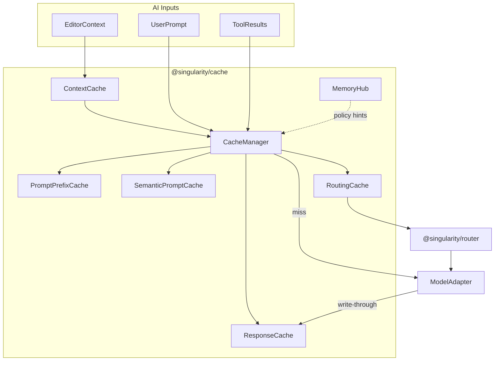
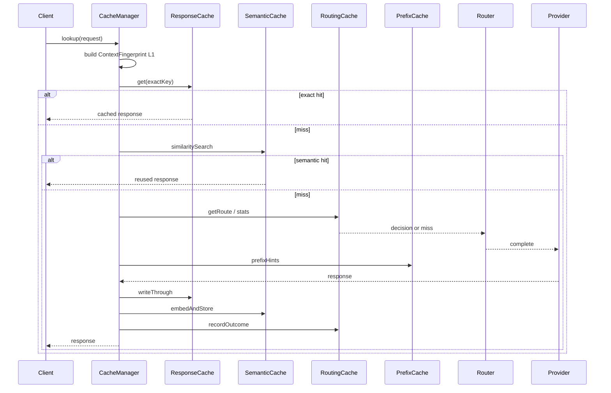
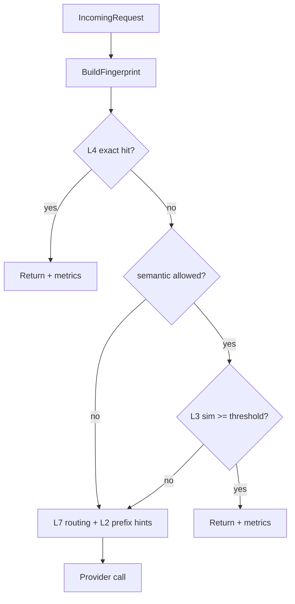
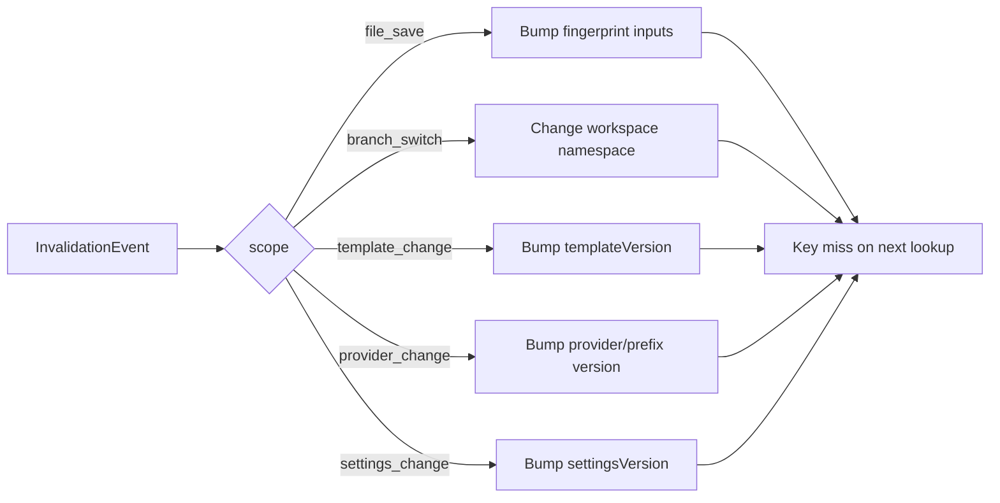
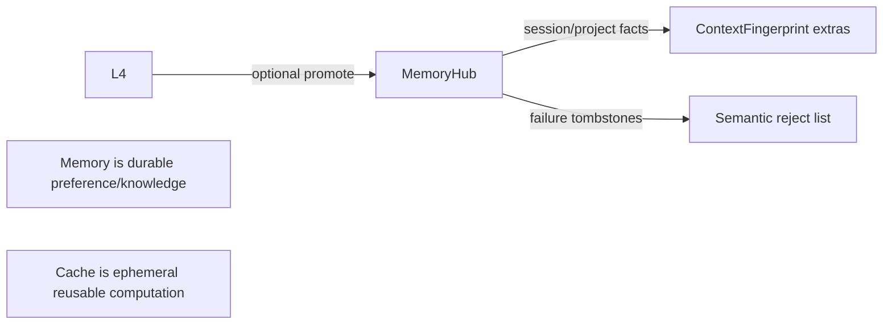
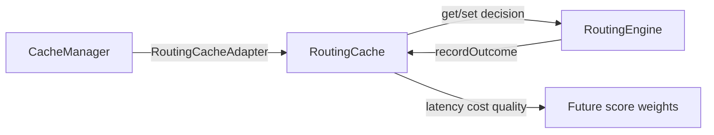

# Singularity Intelligent Caching Engine (AI I/O)

Implementation-ready design for **AI inputs and outputs** in the Singularity IDE.
Package: `@singularity/cache`. Sibling to `@singularity/router`.

---

## 1. Executive summary

Singularity’s caching engine minimizes LLM latency, token spend, and redundant inference by stacking exact, semantic, and provider-prefix reuse on a local-first path.

**Target:** 80–95% cost reduction on repeated / near-duplicate IDE requests (docs, explain, summary, review, stable chat).

**v1 focus (this package):**

| Layer | Name | Role |
|-------|------|------|
| L1 | Context Cache | Fingerprint of prompt-building inputs |
| L2 | Prompt Prefix Cache | Stable prefix versioning + provider cache hints |
| L3 | Semantic Prompt Cache | Embedding similarity reuse |
| L4 | Response Cache | Exact deterministic reply reuse |
| L7 | Routing Cache | Route decisions + latency/cost/quality history |
| L8 | Memory Hub | Thin interface; memory ≠ cache; feeds fingerprints |

**Deferred:** L0 repo AST/symbols, L5 CLI tool caches, L6 retrieval/RAG, Singularity/IDE wiring.

**Strategy:** local-first (memory + durable KV), provider-agnostic keys, versioned invalidation without full clears.

---

## 2. Detailed architecture



### Request lifecycle



### Cache lookup flow



### Invalidation flow



### Memory integration



### Router integration



---

## 3. Component responsibilities

| Component | Responsibility |
|-----------|----------------|
| `CacheManager` | Orchestrate lookup order, write-through, invalidate, metrics |
| `ContextCache` | Build/store `ContextFingerprint`; short TTL metadata |
| `PromptPrefixCache` | Prefix hash, version, provider hints (`cache_control`, `prompt_cache_key`) |
| `SemanticPromptCache` | Embed, cosine search, threshold + guardrails |
| `ResponseCache` | Exact key → response blob; TTL + confidence |
| `RoutingCache` | Route decisions + outcome histograms |
| `MemoryHub` | Namespaced memory read/write; not a substitute for L1–L4 |
| `MemoryStore` | Hot LRU |
| `SqliteStore` | Durable exact entries (schema-compatible KV; file-backed v1) |
| `InMemoryVectorStore` | Brute-force cosine for L3 MVP |
| `InvalidationController` | Map IDE events → version bumps / namespace changes |
| `CacheMetrics` | Hits/misses/tokens saved by layer |

---

## 4. Data structures

### ContextFingerprint inputs

```ts
interface ContextFingerprintInput {
  openFiles: string[];          // sorted URIs
  activeUri?: string;
  selectionHash?: string;       // hash of selected text
  diagnosticsHash?: string;
  gitDiffHash?: string;
  terminalTailHash?: string;
  clipboardHash?: string;
  imageIds?: string[];
  toolOutputHashes?: string[];
  settingsVersion: string;
  branch: string;
  workspaceId: string;          // privacy boundary
  memoryDigest?: string;        // optional MemoryHub digest
}
```

Fingerprint string: `fp_v1:<sha256_hex16>` (first 16 hex chars of content hash for logs; full hash used in keys).

### Response cache entry

```ts
interface ResponseCacheEntry {
  key: string;
  modelId: string;
  promptNormalized: string;
  fingerprint: string;
  templateVersion: string;
  responseText: string;
  confidence: number;           // 0–1
  createdAt: number;
  expiresAt: number;
  tokenEstimate: number;
}
```

### Semantic entry

```ts
interface SemanticCacheEntry {
  id: string;
  embedding: number[];
  mode: string;
  intent: string;
  fpBucket: string;
  responseText: string;
  confidence: number;
  tombstoned: boolean;
  createdAt: number;
  expiresAt: number;
}
```

---

## 5. Algorithms

### 5.1 Context fingerprint

1. Canonicalize: sort arrays, empty → `""`.
2. Join fields with `\0` separators in fixed order.
3. `sha256(canonical)` → `fp_v1:<hex>`.

### 5.2 Response cache key

```
key = sha256(
  templateVersion | modelId | temperature | fingerprint | normalize(prompt)
)
```

`normalize(prompt)`: trim, collapse internal whitespace for non-code modes; preserve code fences.

**Skip exact cache when:**

- `temperature > 0` (unless `forceCacheable`)
- `mode === 'agent'` or `requiresTools` (unless intent in `CACHEABLE_INTENTS` and `cacheable: true`)
- streaming-only requests that need live side effects

**CACHEABLE_INTENTS:** `DOCUMENTATION`, `EXPLAIN`, `REVIEW`, `SUMMARY` (alias of explain/docs).

### 5.3 Semantic reuse

1. Embed `normalize(prompt)` via `Embedder`.
2. Search vectors filtered by `mode`, `intent`, `fpBucket`, `!tombstoned`.
3. Accept if `cosine ≥ threshold` (default **0.92**).
4. On downvote / failure → tombstone id.
5. Never accept across `workspaceId` boundaries.

### 5.4 Prompt prefix

1. Build stable system + tool schema prefix.
2. `prefixHash = sha256(prefixBody)`.
3. Bump `prefixVersion` when body changes.
4. Emit provider hints:
   - Anthropic: `cache_control: { type: 'ephemeral' }` on prefix blocks
   - OpenAI-compatible: `prompt_cache_key: singularity-pfx-{prefixVersion}-{prefixHash16}`
   - Gemini / local: best-effort; no-op if unsupported

### 5.5 Routing cache

Key (content-aware upgrade over router MVP buckets):

```
routeKey = sha256(intent | mode | fpBucket | hasImages | requiresTools | promptHash16)
```

Store decision + running stats: `latencyMs[]` (capped), `costUsd`, `qualityScore`, `failures`, `timeouts`.

### 5.6 Write-through / background refresh

- **Write-through:** on provider success, sync write L4 (+ L3 embed async).
- **Background refresh:** if entry age > `refreshAfterMs` and still within TTL, revalidate in background while serving stale (optional; off by default for deterministic modes).

---

## 6. Cross-cutting topics

### Cache key design

Include: schema version, workspace namespace, template/provider/settings versions, model id, temperature, fingerprint, normalized prompt (or embedding id). Exclude: wall-clock time, request id, transient UI state.

### SHA-256 vs content hashing

- **SHA-256:** keys, fingerprints, prefix hashes (collision-resistant, stable).
- **Content hashing:** same algorithm over canonical bytes; do not use non-cryptographic hashes for cross-process durability.

### Versioning

`CACHE_SCHEMA_VERSION = 1`. Bump invalidates durable store via migration or namespace prefix `v1:`.

### Compression

v1: none. Future: zstd for response blobs > 4 KiB.

### Encryption / security / privacy

- Workspace-scoped keys (`workspaceId` in every key).
- No cross-workspace reads.
- Optional at-rest encryption for durable blobs (OS keychain key) — interface stub in v1.
- Do not log raw prompts in metrics; log hashes only.
- Clipboard / secrets: hash only; never store clipboard plaintext in L1.

### Offline mode

L4/L7/L3 hits work offline. Misses return `cache_miss`; caller decides local model vs queue.

### Multi-provider

Keys include `modelId` + `providerKind`. Prefix hints are provider-specific adapters.

### Cache warming / lazy loading / background refresh

- Warm: precompute fingerprints on editor focus; optional embed of last N prompts.
- Lazy: open durable store on first miss.
- Background refresh: see §5.6.

### Distributed / enterprise

v1 local-first. Redis interface reserved for multi-instance IDE servers. Never replace workspace isolation.

### Local-first

Memory LRU → durable file KV → optional remote. IDE always usable with disk only.

---

## 7. Invalidation strategy

| Event | Action |
|-------|--------|
| File save | Fingerprint inputs change → natural key miss; no global clear |
| Branch switch | New `branch` in fingerprint + optional namespace suffix |
| Dependency changes | Bump `settingsVersion` or dedicated `depsVersion` |
| Prompt template change | Bump `templateVersion` |
| Provider change | Bump `prefixVersion` / provider tag in keys |
| Settings change | Bump `settingsVersion` |
| Workspace change | New `workspaceId` namespace |

Avoid `clear()` except user “Clear AI cache” or schema migration.

---

## 8. Storage

| Layer | v1 store | Trade-off |
|-------|----------|-----------|
| L1 / L2 meta | Memory LRU | Fast; lost on restart (OK for fingerprints) |
| L4 / L7 | Durable KV (`SqliteStore`, JSON-file schema-compatible) | Simple, zero native deps; swap to better-sqlite3/sql.js later |
| L3 | `InMemoryVectorStore` | Process-lifetime; pluggable `VectorStore` for LanceDB/sqlite-vec |
| Enterprise | Redis (interface stub) | Multi-instance; higher ops cost |

### SQLite schema (production target)

```sql
CREATE TABLE response_cache (
  key TEXT PRIMARY KEY,
  workspace_id TEXT NOT NULL,
  model_id TEXT NOT NULL,
  fingerprint TEXT NOT NULL,
  template_version TEXT NOT NULL,
  response_text TEXT NOT NULL,
  confidence REAL NOT NULL,
  token_estimate INTEGER NOT NULL,
  created_at INTEGER NOT NULL,
  expires_at INTEGER NOT NULL,
  meta_json TEXT
);

CREATE TABLE routing_stats (
  route_key TEXT PRIMARY KEY,
  workspace_id TEXT NOT NULL,
  decision_json TEXT NOT NULL,
  latency_json TEXT NOT NULL,
  cost_usd REAL NOT NULL DEFAULT 0,
  quality_score REAL,
  failures INTEGER NOT NULL DEFAULT 0,
  timeouts INTEGER NOT NULL DEFAULT 0,
  updated_at INTEGER NOT NULL,
  expires_at INTEGER NOT NULL
);

CREATE TABLE prefix_versions (
  prefix_id TEXT PRIMARY KEY,
  prefix_hash TEXT NOT NULL,
  prefix_version TEXT NOT NULL,
  provider_hints_json TEXT NOT NULL,
  updated_at INTEGER NOT NULL
);

CREATE INDEX idx_response_ws_exp ON response_cache(workspace_id, expires_at);
CREATE INDEX idx_routing_ws ON routing_stats(workspace_id);
```

v1 `SqliteStore` persists the same logical rows as JSON documents under an injected directory.

---

## 9. TypeScript surfaces

See `src/` — public exports from `@singularity/cache`:

- `createCacheManager(config?)`
- `buildContextFingerprint(input)`
- `buildResponseCacheKey(parts)`
- `ContextCache`, `PromptPrefixCache`, `SemanticPromptCache`, `ResponseCache`, `RoutingCache`
- `MemoryHub` / `InMemoryMemoryHub`
- `CacheMetrics`
- `createRoutingCacheAdapter()` — shape-compatible with router `InMemoryRouteCache`

---

## 10. Implementation roadmap

| Phase | Work |
|-------|------|
| **0** | Package skeleton, DESIGN, interfaces, tests (this delivery) |
| **1** | Exact L4 + L7 durable; wire metrics |
| **2** | Real embedder + L3 production thresholds |
| **3** | Router depends on `RoutingCacheAdapter`; wrap `ModelAdapter.complete` |
| **4** | IDE context collectors → fingerprint; Singularity Auto-mode optional hook |
| **5** | Redis, encryption, compression, L0/L5/L6 |

---

## 11. Risks and mitigations

| Risk | Mitigation |
|------|------------|
| Semantic false positives | High threshold, mode/intent/fp guards, tombstones |
| Stale context replies | Fingerprint includes files/diff/diagnostics; short TTL |
| PII in cache | Workspace isolation; hash secrets; optional encryption |
| Provider prefix incompat | Soft hints; degrade gracefully |
| Disk growth | TTL eviction + max entries LRU |

---

## 12. Benchmarks

| Metric | Definition |
|--------|------------|
| Hit rate | hits / (hits + misses) per layer |
| Miss rate | 1 − hit rate |
| Latency | p50/p95 lookup vs provider |
| Token savings | sum(tokenEstimate) on hits |
| API cost savings | estimated USD on hits |
| Cache efficiency | tokens saved / bytes stored |
| Memory usage | RSS of LRU + vector store |

**Methodology:** replay anonymized prompt traces; compare cold vs warm; A/B semantic on/off; stress with 10k keys.

---

## 13. Testing

- **Unit:** fingerprint stability, key uniqueness, TTL, semantic reject below threshold, invalidation
- **Integration:** manager lookup → miss → write-through → hit
- **Stress:** concurrent gets/sets; eviction
- **Corruption recovery:** truncate durable file → empty store, no throw
- **Migration:** schema version bump
- **Provider compatibility:** prefix hint builders per provider kind

---

## 14. Future enhancements

- L0 repository cache, L5 tool cache, L6 retrieval cache
- sqlite-vec / LanceDB for L3
- Cross-session semantic with user consent
- Quality-aware TTL (higher confidence → longer TTL)
- Shared enterprise Redis with tenant isolation

---

## Memory vs cache

| | Cache | Memory |
|---|-------|--------|
| Purpose | Reuse computation | Persist knowledge / prefs |
| Lifetime | TTL / invalidation | Long-lived |
| Correctness | Must match inputs | Soft; advisory |
| Interaction | Memory digest → fingerprint; failures → L3 tombstones | |

---

## Appendix: lookup pseudocode

```
function lookup(req):
  fp = contextCache.fingerprint(req.context)
  if !isCacheable(req): return miss(prefixHints(req))
  exact = responseCache.get(key(req, fp))
  if exact: return hit(exact, layer=L4)
  if allowSemantic(req):
    sem = semanticCache.query(req, fp)
    if sem: return hit(sem, layer=L3)
  route = routingCache.get(routeKey(req, fp))
  hints = prefixCache.hints(req)
  return miss({ route, hints, fp })
```
