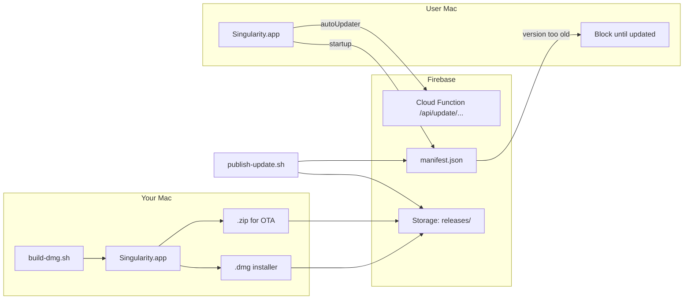

# Singularity macOS distribution & OTA updates

Ship Singularity as a single **DMG** for first install, with **mandatory over-the-air updates** via Firebase.

## Architecture



| Artifact | Purpose |
|----------|---------|
| `Singularity-<ver>-darwin-<arch>.dmg` | First-time install (drag to Applications) |
| `Singularity-darwin-<arch>.zip` | Electron autoUpdater delta/full updates |
| `releases/current.json` | Mandatory min-version gate + download URLs |

## 1. One-time Firebase setup

```bash
npm install -g firebase-tools
firebase login
gcloud auth application-default login   # for Storage uploads via publish script

cd release/update-server
firebase projects:create singularity-updates   # or use an existing project
firebase use singularity-updates

# Set publish secret on the Cloud Function (Firebase Console → Functions → api → Environment)
#   SINGULARITY_PUBLISH_SECRET=<long random string>
```

Copy your Hosting URL (e.g. `https://singularity-updates.web.app`) into `vscode/product.json`:

```json
"quality": "stable",
"updateUrl": "https://singularity-updates.web.app",
"singularityUpdateManifestUrl": "https://singularity-updates.web.app/api/releases/manifest.json"
```

Rebuild Singularity after changing `product.json`.

## 2. Build the DMG (on macOS)

```bash
./scripts/build-dmg.sh
```

Outputs:

- `release/out/Singularity-<version>-darwin-<arch>.dmg`
- `release/out/Singularity-darwin-<arch>.zip`
- `release/out/build-info.json`

First build compiles the entire VS Code fork and can take 30–60 minutes.

Every DMG build **ad-hoc signs** the app automatically so it is not left with a broken linker signature. After installing from the DMG, macOS may still show *"Singularity cannot be opened because the developer cannot be verified"* (Gatekeeper). Fix:

```bash
xattr -cr /Applications/Singularity.app
```

Then open Singularity once via **Right-click → Open** (or **System Settings → Privacy & Security → Open Anyway**). After the first launch, double-click works normally.

### Code signing (required for auto-update)

Electron's macOS autoUpdater **only works with a signed app**. For local testing you can skip signing; OTA will fall back to opening the DMG download page.

```bash
export APPLE_SIGNING_IDENTITY="Developer ID Application: Your Name (TEAMID)"
./scripts/build-dmg.sh
```

For production, also **notarize** the app (Apple requirement for Gatekeeper). See [VS Code's darwin signing scripts](../vscode/build/darwin/sign.ts) for reference.

## 3. Publish an update

```bash
export SINGULARITY_PUBLISH_SECRET=<same secret as Cloud Function>
export MIN_SUPPORTED_VERSION=1.133.0   # users below this are blocked

./scripts/publish-update.sh
```

This:

1. Deploys the update API Cloud Function
2. Uploads `.zip` and `.dmg` to Firebase Storage
3. Publishes `releases/current.json` with `minSupportedVersion`

### Forcing users to update

Set `minSupportedVersion` to the new release when publishing:

```bash
MIN_SUPPORTED_VERSION=1.134.0 ./scripts/publish-update.sh
```

Any installed copy below `1.134.0` will:

1. Fetch `/api/releases/manifest.json` on startup
2. Show a **blocking "Update required"** dialog
3. Download via Electron autoUpdater (signed builds) or open the DMG URL
4. Refuse to proceed until the user restarts into the new version

## Update API (VS Code compatible)

The Cloud Function implements the same endpoint Electron expects:

```
GET {updateUrl}/api/update/{platform}/{quality}/{commit}
```

- **204** — already on latest commit
- **200** — `{ url, version, productVersion, name }` pointing at the `.zip`

Platforms: `darwin`, `darwin-arm64`, `darwin-universal`

## Manual publish (without script)

1. Upload zip/dmg to Firebase Storage under `releases/<version>/`
2. POST to `/api/admin/publish` with the manifest body (see `releases/current.json`)
3. Header: `x-singularity-secret: <SINGULARITY_PUBLISH_SECRET>`

## Troubleshooting

| Issue | Fix |
|-------|-----|
| "Singularity is damaged and can't be opened" / eject disk image | Not corruption — Gatekeeper blocks unnotarized downloads. **Do not open from inside the DMG.** Drag to Applications, then run `xattr -cr /Applications/Singularity.app` in Terminal, or double-click **Install Singularity.command** in the DMG. Permanent fix: Apple Developer ID + notarize. |
| "Singularity.app cannot be opened" / developer cannot be verified | Same as above. After install: Right-click → Open once, or System Settings → Privacy & Security → Open Anyway. |
| "Update required" never clears | Ensure `product.json` `updateUrl` matches Firebase Hosting URL and app was built with that config |
| autoUpdater errors | App must be code-signed with the same identity as updates |
| Manifest fetch fails offline | App allows startup if manifest is unreachable (fail-open). Set stricter behavior in code if needed |
| DMG shows wrong title | Rebuild after `product.json` name changes |

## Files

| Path | Role |
|------|------|
| `scripts/build-dmg.sh` | Full macOS production build + DMG |
| `scripts/publish-update.sh` | Upload artifacts + publish manifest |
| `release/update-server/` | Firebase Hosting + Cloud Function |
| `vscode/.../singularityMandatoryUpdate.contribution.ts` | Startup version gate |
